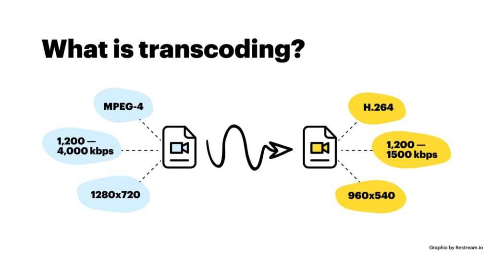
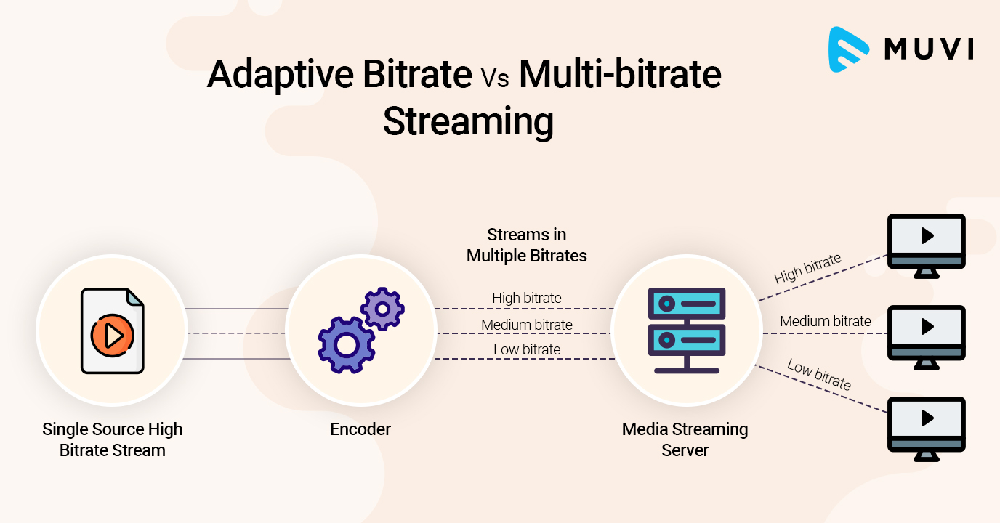
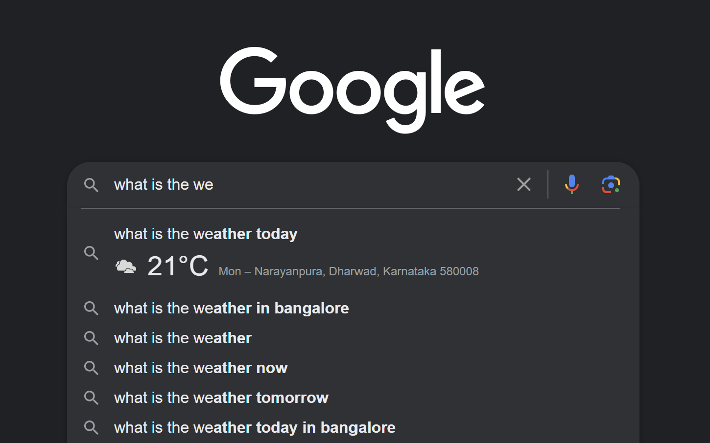
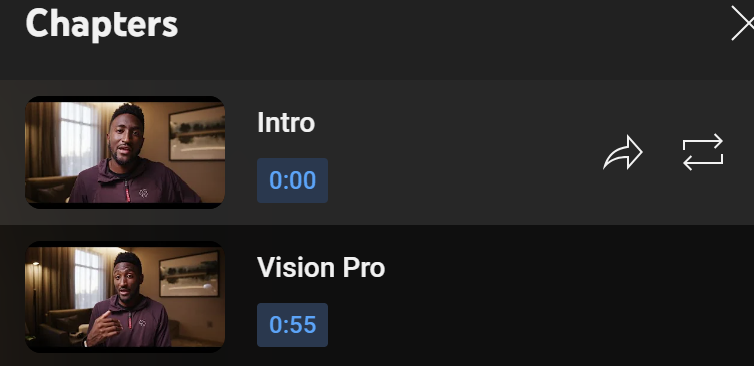

# APS portfolio on OTT streaming services
 - **Course Name:** Algorithmic Problem Solving
 - **Course Code:** 23ECSE309
 - **Name:** Abhishek Pravin Teli
 - **University:** KLE Technological University, Hubballi-31

---

# Overview
The capabilities offered by OTT platforms are examined and analyzed in this portfolio, together with the algorithms that were utilized to carry out each functionality and the time and space efficiency of each.

---

# Table of contents
1. [Introduction](#introduction)
2. [Objectives](#objectives)
3. [System design](#system-design)
4. [Functionalities](#functionalities)
5. [References](#references)

---

# Introduction
With the growth of the internet, OTT platforms have been among the most innovative services that have attracted a lot of attention and users. The OTT platforms' unparalleled flexibility made it possible for them to gain a lot of popularity quickly; as a result, scale—which is advantageous from a business perspective but challenging from a technical one—became essential to manage. Thus, guaranteeing the scalablity of service offerings requires making sure that the proper components are employed in the right way.
 

The algorithms employed in the design of these services and features are a key element in achieving the scale effectively as previously discussed. All programming that implements a certain business logic is fundamentally made up of well-defined algorithms. Since algorithms and data structures are the foundation of any tech-business solution, choosing the appropriate ones is crucial.

In this portfolio, we examine in more detail the crucial role algorithms play in the seamless operation of over-the-top (OTT) services.

---

# Objectives
- Examine the latest algorithms in the OTT streaming services industry.
- Provide appropriate design strategies and algorithms.
- Make changes and enhancement suggestions for the current algorithms.

---

# System Design
- Within this system, the principal users are:
    1. **Watchers,** the one viewing the live streaming of videos.
    2. The individuals who share their content are known as **content creators / uploaders**.
    3. The company that offers the over-the-top (OTT) services is referred to as **The platform providers**.
- System architecture: 
    - With numerous separate service providers, such as streaming, uploading, transcoding, etc., the system would have a microservices architecture.
    - Due to its dispersed nature, the system requires orchestrators for proper functioning.
    - For efficient inter-service communication, a pub-sub mechanism would also be present.
    - The content providers' uploads must be accepted by the upload service.
    - Once the video has been uploaded, the transcoding service takes it and converts it into various formats and resolutions.
    - The streaming provider has the responsibility of providing the video for streaming anytime a user requests it.
- Process / walk-through:
    - A video is first uploaded to the platform by a content creator using an upload service.
    - The upload service alerts the transcoding service to begin transcoding as soon as the upload is finished.
    - The video is transcoded into various resolutions in the MPEG-DASH or HLS format, etc., upon getting this message.
    - The video is now ready to be watched after this stage is finished.
    - The user receives the video through the streaming service whenever they request it.

---

# Functionalities

1.  **Security and Access Control**
    - This is a very crucial aspect in case of OTT platforms due to increasing movie piracy.
    - Multiple users use the common account which affects the bussiness of the OTT platforms.

    - **Data structure/Algorithm**: 
        - [Access-Control-lists](https://www.fortinet.com/resources/cyberglossary/network-access-control-list#:~:text=Network%20Access%20Control%20List%20Meaning,are%20allowed%20in%20the%20doors.) can be used to verify the accounts.
        - [Merkel Trees](https://github.com/abhishekteli4978/APS_Portfolio/blob/main/codes/merkel.cpp) can be used to verify the data consistency.
    - **Time Complexity**:
        - Merkel Trees.
            - Searching/Insertion/Deletion/Synchronization: O(log n)
            - Traversal: O(n).

    - Code links have been highlighted in blue.

2. **Multi-parameter filtering**
    - This feature enables users to filter the content based on multiple parameters like genre, language, year etc.
    - **Data structure**: Data structures like [BST, B-trees](https://github.com/abhishekteli4978/APS_Portfolio/blob/main/codes/btree.cpp) help in effectively filtering the content.
    - **Algorithm**: Algorithms like [Union-find](https://github.com/abhishekteli4978/APS_Portfolio/blob/main/codes/unionFind.cpp) help in identifying the similar filters to ones provided by the user.
    - Code links have been highlighted in blue.
    - **Time Complexity**:
        - B Trees.
            - Insert/Delete/Search: O(log n) 
        - Union Find.
            - Union/Find: O(α(n))
    - **Space Complexity**:
        - B Trees and Union-find: O(n).

3. **Video transcoding**
    - Video transcoding is the process of converting a video file from one format or codec to another. This is typically done to ensure compatibility with various playback devices, streaming platforms, or to reduce the file size while maintaining acceptable quality. Transcoding can involve changing the video’s resolution, bitrate, codec, and other parameters.

    

    - Netflix prominently uses the serverless video transcoding.
    - We can optimize the above process by use of efficient data structures and algorithms.
    - **Algorithms**
        - Parallel Merge sort algorithm can be used to split the video into smaller segments and transcode the smaller segments.
        - It is a divide and conquer statergy algorithm.
        - Here is a code for [Merge-Sort](https://github.com/abhishekteli4978/APS_Portfolio/blob/main/codes/mergeSort.cpp).
    - **Data Structures**
        - Hash table for caching the results.
    - **Time Complexity**: 
        - Merge Sort: 
            - Best/Worst/Average Case --> O(n * log n)
    - **Space Complexity**: O(n).
    - Code links have been highlighted in blue.

4. **Bandwidth allocation and Load Balancing**
    - OTT platforms need to allocate the bandwidth based on among users based on demand and priority.
    - There is also need of load balancing to distribute the load among the multiple servers

    -**Data Structures**
    - We can use a segment tree to maintain and update the bandwidths allocated to users.
    - The Segment tree can also be employed to keep track of current load on each server.
    - Here is sample code of [segment trees](https://github.com/abhishekteli4978/APS_Portfolio/blob/main/codes/segment.cpp)

    -**Time Complexity**
    - Creation/Deltion/Update: O(n * log n)

    -**Space Complexity**
    - O(n).

5. **Dynamic Adaptive Streaming over HTTP(DASH)**
    - It is a streaming technique that adapts video quality according tothe network conditions.
    - DASH has algorithms and data structure for efficient manangement of video segments.
    - Here is wikipedia article for [DASH](https://en.wikipedia.org/wiki/Dynamic_Adaptive_Streaming_over_HTTP)

6. **Adaptive bitrate streaming**
    
    - ABR refers to the process of making streaming available in multiple video/audio resolutions to choose from and optionally, switching between multiple resolutions based on the user's available bandwidth.
    - **Data structure**: Data structures like [queues](https://github.com/abhishekteli4978/APS_Portfolio/blob/main/codes/queues.cpp) can be used for buffering, etc.
    - **Algorithms**: Few of the popular ABR algorithms/protocols are MPEG-DASH, HLS etc.
    - **Time Complexity**: [Heap_data_structure](https://github.com/abhishekteli4978/APS_Portfolio/blob/main/codes/heapify.cpp) for queueing.
        - Insert/Delete/Extract: O(log n).
    - **Space Complexity**: O(n).

    - Code links have been highlighted in blue.

    

8. **Data Compression**

    - The OTT platforms manage humongous amount of data every day.
    - The Data needs to compressed as compressed data can be managed more efficiently.

    - **Algorithms**:
        - Huffman coding
            - Huffman coding is a lossless data compression algorithm. The idea is to assign variable-length codes to input characters, lengths of the assigned codes are based on the frequencies of corresponding characters.
        - Here is sample code for [Huffman Coding](https://github.com/abhishekteli4978/APS_Portfolio/blob/main/codes/huffman.cpp)
    
    - **Time Complexity**:
        - O(n * log n) where n is the number of unique characters

    - **Space Complexity**:
        - O(n).

8. **Typeahead search**
    - Typeahead search refers to the functionality where the user types a part of the query he/she is intending to search and the potential list of completed queries is prompted back to the user to choose from.
    - **Data structure**: [Trie](https://github.com/abhishekteli4978/APS_Portfolio/blob/main/codes/trie.cpp) is a popular data structure to perform operations on dictionary like functionalities.
    - **Algorithms**: Trie can be used in conjuction with algorithms like [BFS](https://github.com/abhishekteli4978/APS_Portfolio/blob/main/codes/bfs.cpp), [DFS](https://github.com/abhishekteli4978/APS_Portfolio/blob/main/codes/dfs.cpp) to find the k-nearest words.
    - **Time Complexity**:
        - Insert/Search: O(n).
    - **Space Complexity**: O(n).
    - Code links have been highlighted in blue.

    

9. **Timestamps / Chapters**
    - Timestamps/chapters are the key-moments in a video where an important subject is being streamed. Allowing users to skip directly to the timestamps results in saving huge amount of bandwidth and time.
    - **Data structure**: Linear data structures like array, [queues](https://github.com/abhishekteli4978/APS_Portfolio/blob/main/codes/queues.cpp) would be used here.
    - **Algorithms**: Algorithms like [max-sum sliding-window](https://github.com/abhishekteli4978/APS_Portfolio/blob/main/codes/slidingWindow.cpp) would help in identifying the key moments in the video. Caching those results using data structures like hash-tables will greatly reduce the latency.
    - Code links have been highlighted in blue.

    

10. **Most-watched / Most-replayed**
    - This features enables users to look at the most viewed segments in a given video. This is a constantly changing parameter as the watch time of individual user keeps on changing as per their requirements over a range of time.
    - This is more useful to the content creator as they can retrospect on their content and watch-behaviour of their users.
    - **Data structure / Algorithm**: Data structures like [Fenwick trees](https://github.com/abhishekteli4978/APS_Portfolio/blob/main/codes/fenwickTree.cpp), [Segment trees](https://github.com/abhishekteli4978/APS_Portfolio/blob/main/codes/rangeUpdateQuery.cpp) can optimise the process of generating this analytics they are better suited for range updates.
    - **Time Complexity**:
        - Creation: O(n log n)
        - Update/Query: O(log n)
    - **Space Complexity**: O(n).
    - Code links have been highlighted in blue.

11. **Personalised recommendation system**
    - This feature enables users to get recommendations based on their watch history and the preferences as suggested by the user himself/herself.
    - **Data structure / Algorithm**: Machine learning algorithms/techniques like deep learning, NLP etc. can be used to effectively generate the personalised feed for each user.

# References
[1]  "Adaptive Bitrate Streaming (ABR): What is it & How Does it Work?", Andy Francis, Bitmovin, 2023. Available: [https://bitmovin.com/adaptive-streaming](https://bitmovin.com/adaptive-streaming)

[2]  "Design Typeahead (Autocomplete) System", System Design School, 2023. Available: [https://systemdesignschool.io/problems/typeahead/solution](https://systemdesignschool.io/problems/typeahead/solution)

[3]  "Knutt-Moris-Pratt algorithm", Taneesha Mathur, Scaler, 2024. Available: [https://www.scaler.com/topics/data-structures/kmp-algorithm/](https://www.scaler.com/topics/data-structures/kmp-algorithm/)

[4]  "Fast forward moving picture experts group", FFmpeg, 2024. Available: [https://ffmpeg.org/](https://ffmpeg.org/)

[5]  "How Streaming Services Use Algorithms", Arts and technology management group, 2021. Available: [https://amt-lab.org/blog/2021/8/algorithms-in-streaming-services](https://amt-lab.org/blog/2021/8/algorithms-in-streaming-services)

[6]  "Introduction to Merkle Tree", GeekforGeeks,2024, Availalble: [https://www.geeksforgeeks.org/introduction-to-merkle-tree/](https://www.geeksforgeeks.org/introduction-to-merkle-tree/)

[7]  "Huffman Coding | Greedy Algo-3", GeekforGeeks Sanchhaya Education Private Limited, 2024. Available: [https://www.geeksforgeeks.org/huffman-coding-greedy-algo-3/](https://www.geeksforgeeks.org/huffman-coding-greedy-algo-3/)